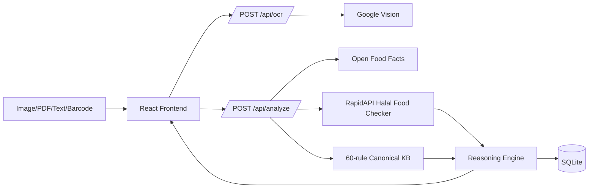
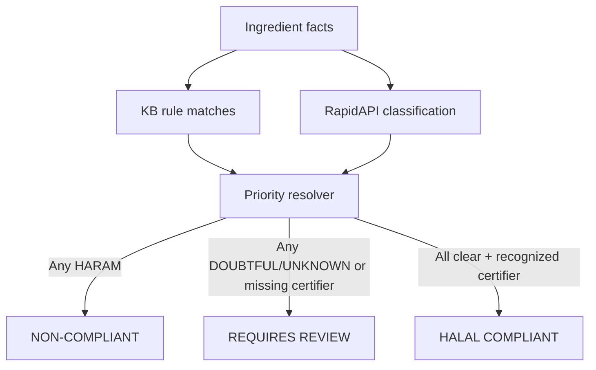

# Technical Report: HalalScan

HalalScan follows the submitted proposal: React frontend, Flask backend, Google Vision OCR, RapidAPI Halal Food Checker, Open Food Facts barcode lookup, a canonical 60-rule knowledge base, deterministic reasoning, and SQLite history/cache storage.

## Architecture



Legacy Gemini, Tesseract, and local Naive Bayes paths are retained only as fallback support. The primary architecture is Google Vision + RapidAPI + Knowledge-Based Reasoning.

## Verdict Logic



Conflict priority is `HARAM > DOUBTFUL > UNKNOWN > HALAL`. The API response exposes the logic path, matched rules, facts, conflict resolution, certification check, and evaluation notes under `architectureDetails.krrAnalysis`.

## Knowledge Base

`backend/data/halal_rules.json` is the source of truth. It contains 60 structured rules, E-number mappings, keyword triggers, reasons, source labels, and recognized certifying-body records for JAKIM, MUI, IFANCA, HFA, and ESMA.

## Evaluation

| Check | Result |
|---|---:|
| Canonical KR&R dataset | 30/30 correct |
| Local ML fallback holdout | 36/36 correct |
| Backend tests | 14/14 passing |
| TypeScript check | Passing |
| Vercel API smoke tests | Passing |

Run:

```bash
npm run lint
npm run evaluate
npm run test:backend
npm run test:vercel-api
npm run build
```

## Limitations

- Live OCR and RapidAPI classification require credentials.
- Certifying-body verification is list-based and does not authenticate official certificates.
- Non-English labels may require translation.
- Knowledge-base rules need expert review before production use.
