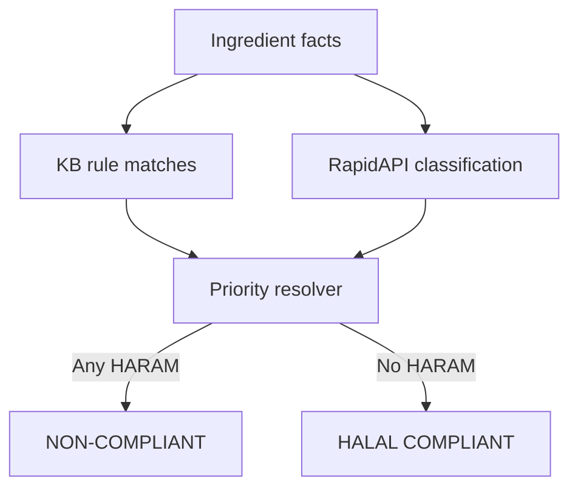

# Technical Report: HalalScan

HalalScan follows the submitted proposal: React frontend, Flask backend, Google Vision OCR, RapidAPI Halal Food Checker, Open Food Facts barcode lookup, a canonical 67-rule knowledge base, deterministic reasoning, and SQLite history/cache storage.

## Architecture


Legacy Gemini, Tesseract, and local Naive Bayes paths are retained only as fallback support. The primary architecture is Google Vision + RapidAPI + Knowledge-Based Reasoning.

The chat assistant includes lightweight retrieval over the canonical rule base. This RAG path explains matching rule IDs and sources, but it does not override `/api/analyze` verdicts.

## Verdict Logic



Product-level conflict priority is `HARAM > HALAL`: any haram ingredient produces `NON-COMPLIANT`, otherwise the product result is `HALAL COMPLIANT`. Ingredient-level evidence can still show `DOUBTFUL` or `UNKNOWN`, and certifying-body status is shown as supporting evidence rather than a product-level "maybe" trigger. The API response exposes the logic path, matched rules, facts, conflict resolution, certification check, and evaluation notes under `architectureDetails.krrAnalysis`.

## Knowledge Base

`backend/data/halal_rules.json` is the source of truth. It contains 67 structured rules, E-number mappings, keyword triggers, reasons, source labels, and recognized certifying-body records for JAKIM, MUI, IFANCA, HFA, and ESMA.

## Evaluation

| Check | Result |
|---|---:|
| Canonical KR&R dataset | 30/30 correct |
| Local ML fallback holdout | 36/36 correct |
| Backend tests | 21/21 passing |
| TypeScript check | Passing |
| Vercel API smoke tests | Passing |
| Badge visual smoke test | Passing |

Run:

```bash
npm run lint
npm run evaluate
npm run test:backend
npm run test:vercel-api
npm run test:badges
npm run build
```

## Limitations

- Live OCR and RapidAPI classification require credentials.
- Certifying-body verification is list-based and does not authenticate official certificates.
- Non-English labels may require translation.
- Knowledge-base rules need expert review before production use.
- The 100% evaluation scores are from curated classroom datasets and regression cases, not a production accuracy guarantee.
