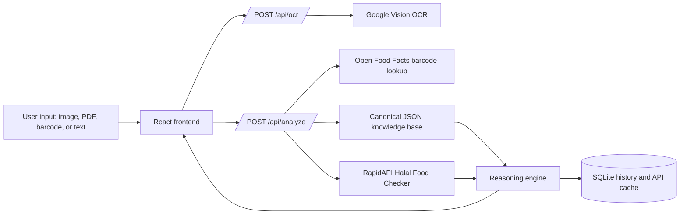
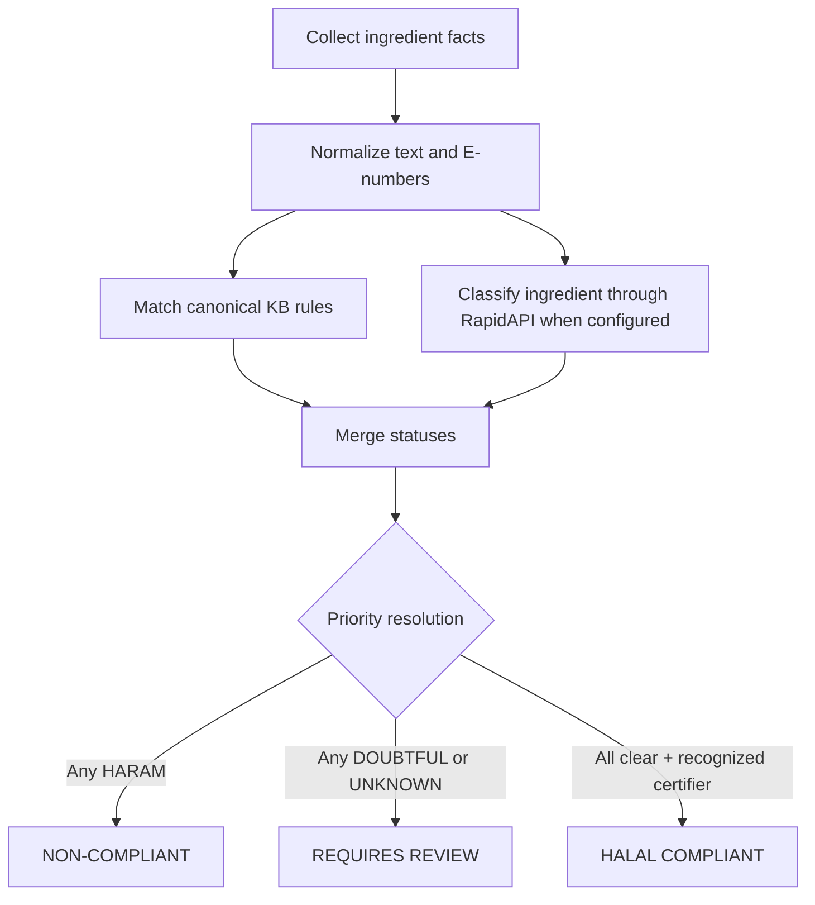

# Technical Report: HalalScan

HalalScan implements the submitted DOCX architecture: React frontend, Flask backend, Google Vision OCR, RapidAPI Halal Food Checker, Open Food Facts barcode lookup, a canonical 60-rule knowledge base, deterministic reasoning, and SQLite scan history.

## Architecture

The backend knowledge base at `backend/data/halal_rules.json` is the source of truth. The frontend Knowledge and Evaluation views now use this same JSON data instead of the older small keyword list.

Legacy Gemini, Tesseract, and local Naive Bayes code remains available only as fallback support when the primary backend or credentials are unavailable. It is not presented as the main architecture.

## Reasoning Flow

Conflict priority is explicit: `HARAM > DOUBTFUL > UNKNOWN > HALAL`. The final response includes trace evidence under `architectureDetails.krrAnalysis`, including facts, matched rules, conflict resolution, certification check, evaluation notes, and the logic path.

## Knowledge Base

The canonical KB contains:

- 60 structured rules across additives, pork, alcohol, animal sources, dairy, meat, seafood, plant ingredients, processing, and certification.
- E-number taxonomy for high-risk additives such as `E120`, `E441`, `E471-E477`, `E481-E483`, `E542`, `E904`, and `E920`.
- Recognized certifying bodies: JAKIM, MUI, IFANCA, HFA, and ESMA.
- Per-rule fields: `id`, `category`, `title`, `status`, `e_numbers`, `keywords`, `reason`, and `source`.

## Evaluation Methodology

The evaluation separates three evidence layers:

| Layer | Purpose | Evidence |
|---|---|---|
| RapidAPI integration | Primary ML classification layer | Client wrapper, cache, status normalization, deterministic no-key tests |
| Canonical KR&R | Rule-based halal decision logic | 30 curated product cases with precision/recall/F1 and confusion matrix |
| Local ML fallback | Coursework comparison and offline backup | 36 holdout cases, model metadata, confusion matrix |

Current reproducible results:

| Check | Result |
|---|---:|
| `npm run lint` | Passing |
| `npm run evaluate` | KR&R 30/30, local ML fallback 36/36 |
| `npm run test:backend` | 14/14 passing |
| `npm run test:vercel-api` | Passing |

## Interfaces

Public routes remain stable:

- `POST /api/ocr`
- `POST /api/analyze`
- `GET /api/rules`
- `GET /api/history`
- `GET /api/health`

Final verdict labels remain:

- `HALAL COMPLIANT`
- `NON-COMPLIANT`
- `REQUIRES REVIEW`

## Limitations

- Live Google Vision OCR and RapidAPI classification require external credentials.
- Certifying-body verification is list-based and does not authenticate official certificates against government databases.
- Non-English labels may need translation before reliable ingredient reasoning.
- Halal rulings can vary by school of law; the maintained rules use the project’s default general standard and route doubtful cases to review.
- The KB is suitable for academic demonstration but would require expert review before production use.
